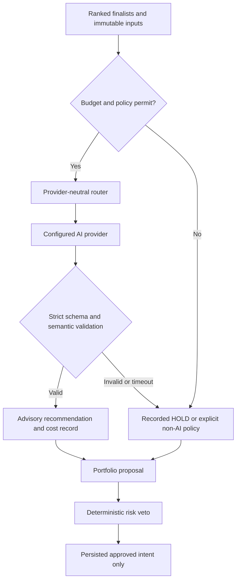

# AI flow

```mermaid
flowchart TD
    Finalists[Ranked finalists and immutable inputs] --> Budget{Budget and policy permit?}
    Budget -->|Yes| Router[Provider-neutral router]
    Router --> Provider[Configured AI provider]
    Provider --> Validate{Strict schema and semantic validation}
    Validate -->|Valid| Recommendation[Advisory recommendation and cost record]
    Validate -->|Invalid or timeout| Fallback[Recorded HOLD or explicit non-AI policy]
    Budget -->|No| Fallback
    Recommendation --> Portfolio[Portfolio proposal]
    Fallback --> Portfolio
    Portfolio --> Risk[Deterministic risk veto]
    Risk --> Intent[Persisted approved intent only]
```
