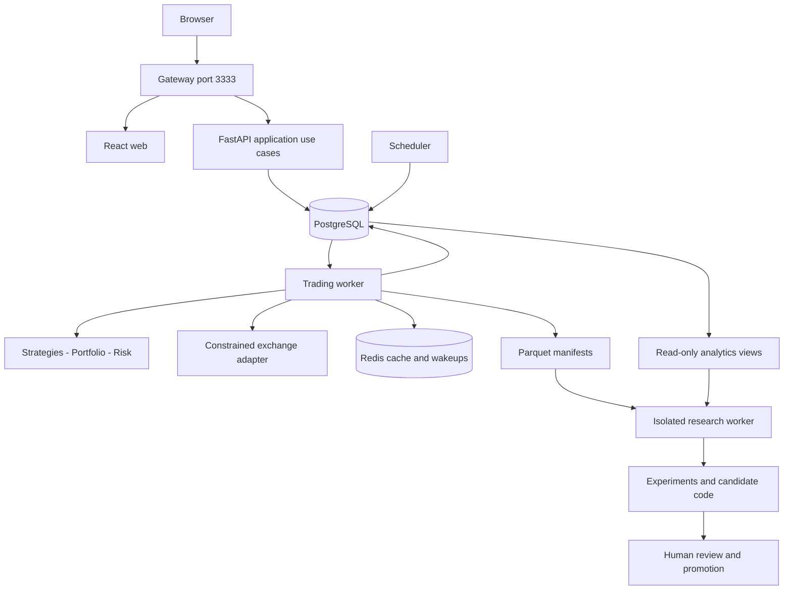

# Architecture

```mermaid
flowchart TB
    User[Browser] --> Gateway[Gateway port 3333]
    Gateway --> Web[React web]
    Gateway --> API[FastAPI application use cases]
    API --> DB[(PostgreSQL)]
    Scheduler[Scheduler] --> DB
    DB --> Worker[Trading worker]
    Worker --> Domain[Strategies - Portfolio - Risk]
    Worker --> Exchange[Constrained exchange adapter]
    Worker --> DB
    Worker --> Redis[(Redis cache and wakeups)]
    Worker --> History[Parquet manifests]
    History --> Research[Isolated research worker]
    DB --> Views[Read-only analytics views]
    Views --> Research
    Research --> Artifacts[Experiments and candidate code]
    Artifacts --> Human[Human review and promotion]
```
