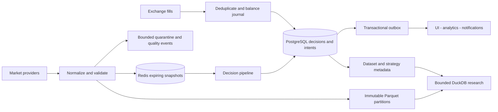

# Data flow

```mermaid
flowchart LR
    Providers[Market providers] --> Normalize[Normalize and validate]
    Normalize --> Hot[(Redis expiring snapshots)]
    Normalize --> Historical[Immutable Parquet partitions]
    Normalize --> Quarantine[Bounded quarantine and quality events]
    Hot --> Decision[Decision pipeline]
    Decision --> PG[(PostgreSQL decisions and intents)]
    Fills[Exchange fills] --> Transaction[Deduplicate and balance journal]
    Transaction --> PG
    PG --> Outbox[Transactional outbox]
    Outbox --> Consumers[UI - analytics - notifications]
    Historical --> DuckDB[Bounded DuckDB research]
    PG --> Manifest[Dataset and strategy metadata]
    Manifest --> DuckDB
```
