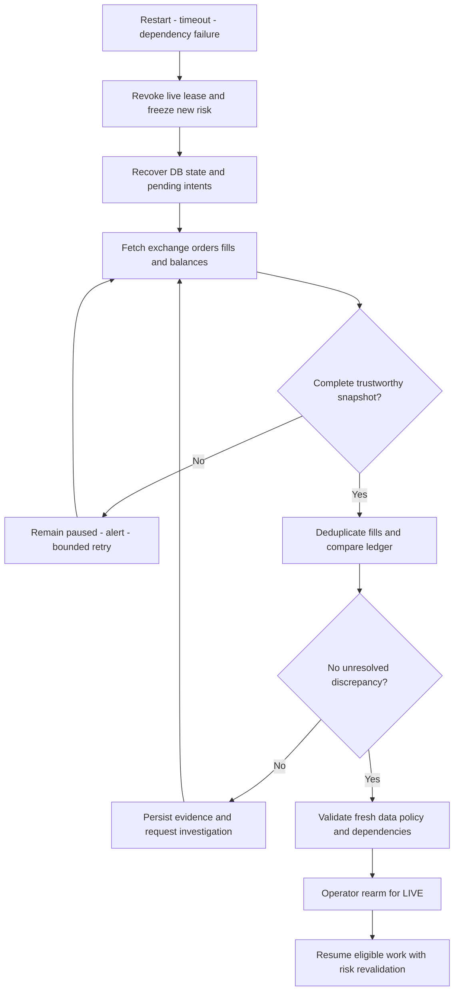

# Recovery

```mermaid
flowchart TD
    Failure[Restart - timeout - dependency failure] --> Pause[Revoke live lease and freeze new risk]
    Pause --> Durable[Recover DB state and pending intents]
    Durable --> Fetch[Fetch exchange orders fills and balances]
    Fetch --> Complete{Complete trustworthy snapshot?}
    Complete -->|No| Hold[Remain paused - alert - bounded retry]
    Hold --> Fetch
    Complete -->|Yes| Reconcile[Deduplicate fills and compare ledger]
    Reconcile --> Match{No unresolved discrepancy?}
    Match -->|No| Operator[Persist evidence and request investigation]
    Operator --> Fetch
    Match -->|Yes| Health[Validate fresh data policy and dependencies]
    Health --> Rearm[Operator rearm for LIVE]
    Rearm --> Resume[Resume eligible work with risk revalidation]
```
