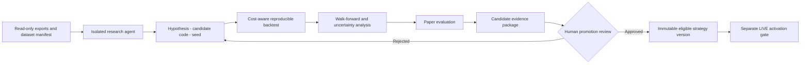

# Research and promotion flow

```mermaid
flowchart LR
    Inputs[Read-only exports and dataset manifest] --> Agent[Isolated research agent]
    Agent --> Experiment[Hypothesis - candidate code - seed]
    Experiment --> Backtest[Cost-aware reproducible backtest]
    Backtest --> Validation[Walk-forward and uncertainty analysis]
    Validation --> Paper[Paper evaluation]
    Paper --> Candidate[Candidate evidence package]
    Candidate --> Human{Human promotion review}
    Human -->|Approved| Registry[Immutable eligible strategy version]
    Human -->|Rejected| Experiment
    Registry --> Activation[Separate LIVE activation gate]
```
