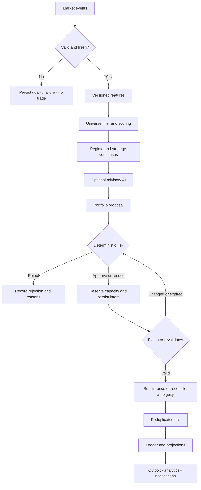

# Trade decision flow

```mermaid
flowchart TD
    Market[Market events] --> Quality{Valid and fresh?}
    Quality -->|No| Block[Persist quality failure - no trade]
    Quality -->|Yes| Features[Versioned features]
    Features --> Rank[Universe filter and scoring]
    Rank --> Signals[Regime and strategy consensus]
    Signals --> AI[Optional advisory AI]
    AI --> Allocation[Portfolio proposal]
    Allocation --> Risk{Deterministic risk}
    Risk -->|Reject| Record[Record rejection and reasons]
    Risk -->|Approve or reduce| Reserve[Reserve capacity and persist intent]
    Reserve --> Check{Executor revalidates}
    Check -->|Changed or expired| Risk
    Check -->|Valid| Submit[Submit once or reconcile ambiguity]
    Submit --> Fill[Deduplicated fills]
    Fill --> Ledger[Ledger and projections]
    Ledger --> Events[Outbox - analytics - notifications]
```
